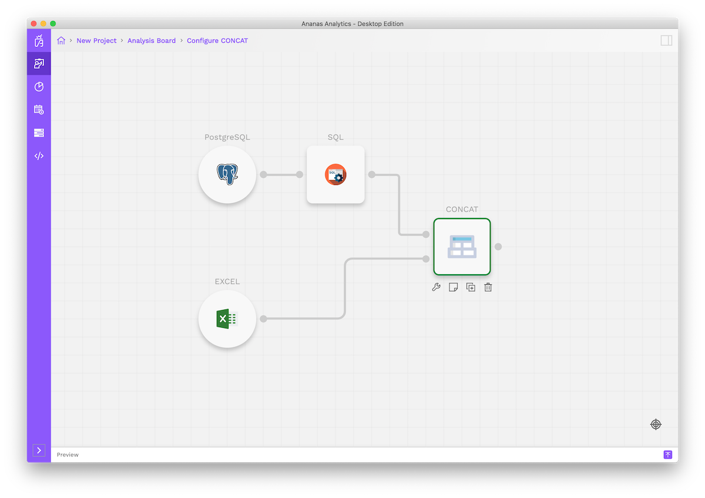

Merging two datasets having same fields/columns

## Objective
Sometimes you have same data in two different sources. Getting data in a single source can be frustrating in Excel. If you know SQL you can use a UNION.

## Solution
In Ananas you don't need to know how to write Excel formulas or SQL queries to concatenate two sources. 
And once you've built a data flow it's automatically repeatable whenever new data comes in. 
To concatenate your multiple data sets you can use a “Concatenate” step.

