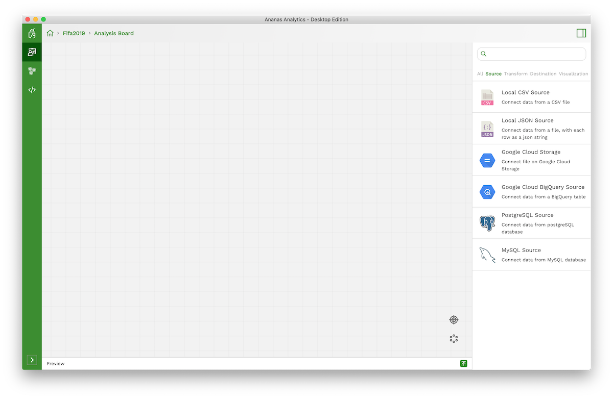

Ananas Analytics Desktop lets you organize your analysis work by projects. Any project consists of an analysis board where a set of steps can be connected to each other. 

## Creating a new project

To create your first project, click on the `+` button then fill in the project name and description.

Congratulations! you've created your first project. You can start working on your project analysis board.

