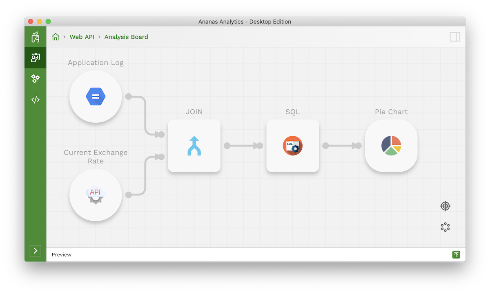

From Ananas Desktop 0.9.0, you can use the new **Web API data source** to integrate web API into your current data analysis flow.

**Web API data source** automatically transforms returned JSON data into a data table, so that you can transform it using SQL as any other data sources.

<!--truncate-->

For example, the following exchange rate API returns a JSON string:


```json
GET https://api.exchangeratesapi.io/latest HTTP/1.1

{
  "base": "EUR",
  "date": "2018-04-08",
	"rates": {
    "CAD": 1.565,
    "CHF": 1.1798,
    "GBP": 0.87295,
    "SEK": 10.2983,
    "EUR": 1.092,
    "USD": 1.2234,
    ...
  
	}

}
```

**Ananas Desktop** `Web API data source` turns it into the following table:

| base | date | rates.CAD | rates.GBP | ... |
|---|---|---|---|---|
| EUR  | 2018-04-08  | 1.565  | 1.1798 | ...  |

You can also filter the json object with [JSON Path](https://goessner.net/articles/JsonPath/). More details please see our user guide.

Another exiting feature we support from 0.9.0 is the `Excel` data source. You can now forget about the `VLOOKUP` function in excel and use SQL to join excel tables. It also opens the door for you to integrate excel data with other data sources, for example, a `PostgreSQL` database. There are plenty of possibilities out there waiting for you to explore. 

On visualization side, 0.9.0 brings `Pie chart` into the visualization collection. And we enhanced the `Bar chart` with additional settings. You can now use the same bar chart step to visualize your data in a stacked way or side by side way, vertically or horizontally

Several new command line interfaces are introduced in 0.9.0 to help engineers integrate Ananas into their current data workflow.  

There are several other improvements included in 0.9.0 too. Here is the release note:


## Release Note 

### New Features

- add new workspace setting `disableCheckUpdateOnStart` to disable the update check when start the app
- add Web API source. Now it is possible to explore, and analyze data from Web API
- add Excel data source.
- add SQL function `TO_DATE` to convert string type data to date type 
- add `Pie chart` visualization step.
- improve `Bar chart` visualization step. Support stacked bar chart, horizontal bar chart and vertical bar chart
- add `Find project in file explorer` option in project selection view to locate project folder
- add new `StringMap` component for step editor. It allows editor to edit string-string type map
- add new CLI `explore` command to explore data source
- add new CLI `view` command to get visualization step result
- add new parameter `host` to `start` command to specify the server host
- add new example `Temperature Forcast`. See [ananas-examples](https://github.com/ananas-analytics/ananas-examples)
- add new example `MySQL`. See [ananas-examples](https://github.com/ananas-analytics/ananas-examples)
- add new example `PostgreSQL`. See [ananas-examples](https://github.com/ananas-analytics/ananas-examples)
- add new example `Excel`. See [ananas-examples](https://github.com/ananas-analytics/ananas-examples)

### Bug fixes / Improvements

- Fix the issue that CLI exits with code 0 when meeting error in some cases
- Fix the issue that CLI `start` command listens to `0.0.0.0:3003` by default. Now it listen to `127.0.0.1:3003` by default
- Fix derby access issue when `run` a visualization step from CLI
- Upgrade sparkjava dependency to version `2.9.1`
- Fix a issue that keep loading the project that is deleted from disk
- Fix Linux & Window new version update dialog has no acknowledge button issue
- Fix `ananas` process not being killed when close app on MacOS issue
- Improve postgres schema auto detection
- Improve several error messages
- Improve tests
